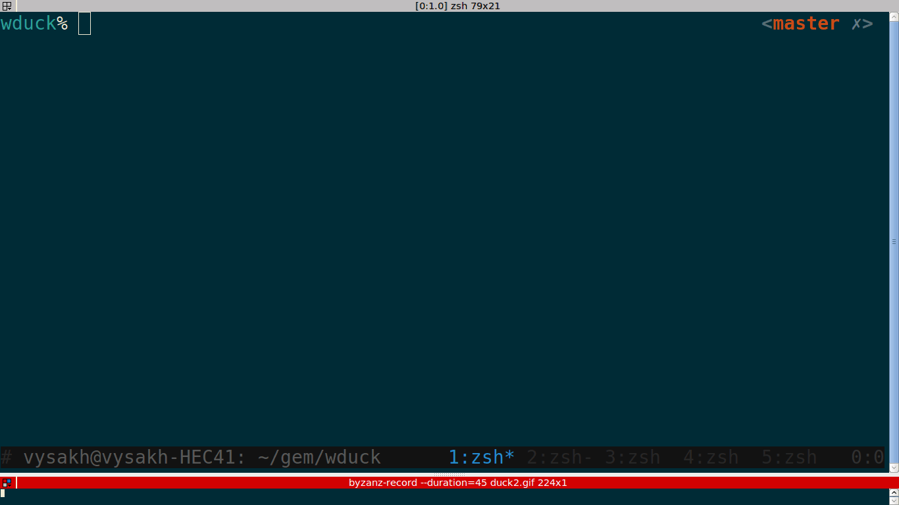

WDuck
====
WDuck(Wicked Duck) is a commond line tool to use the zero click feature of duckduckgo. Refer [duckduckgo goodies](https://duckduckgo.com/goodies).

##### Installation

This is a ruby gem, ruby should be installed for the gem to be installed.

``` bash
gem install wduck --pre
```

##### Usage
wduck duck [Search term]




##### License
MIT
